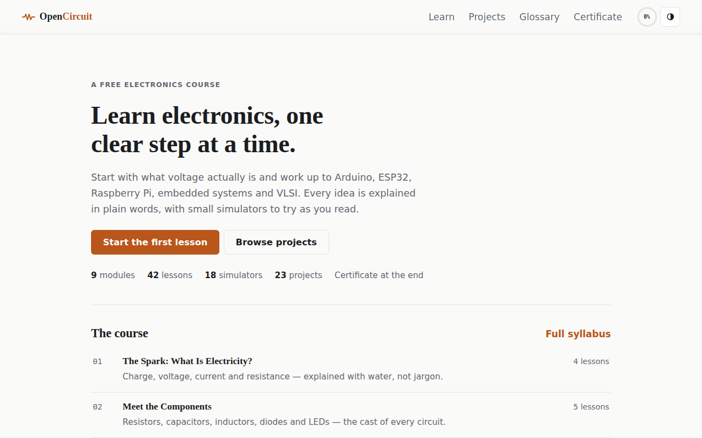
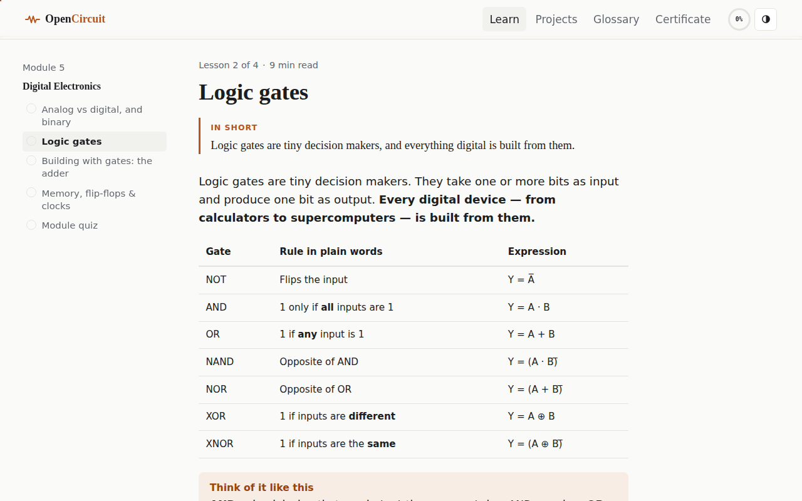
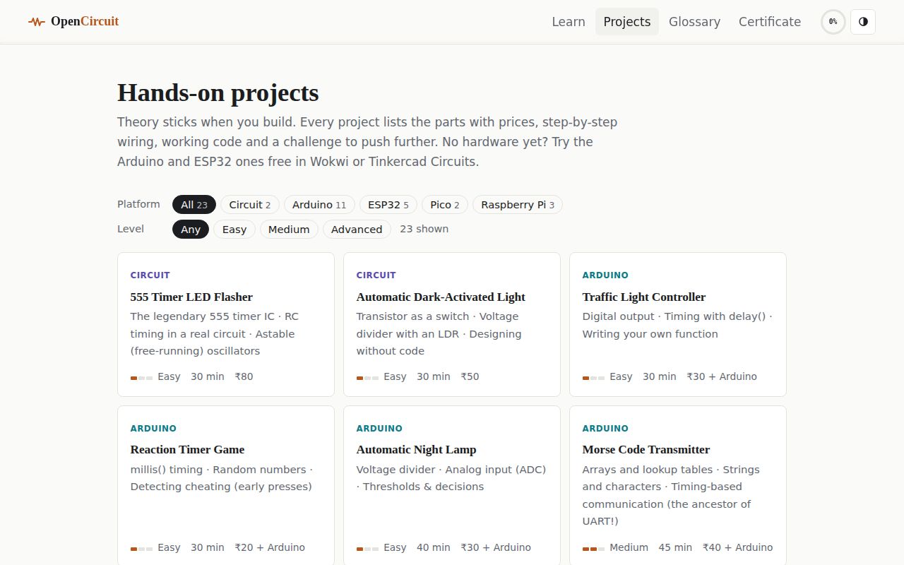
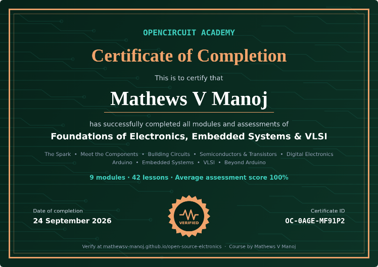

# OpenCircuit Academy

**A free, interactive electronics course: from "what is voltage?" to Arduino, ESP32, Raspberry Pi, embedded systems and VLSI.**

**[Open the course →](https://mathewsv-manoj.github.io/open-source-elctronics/)**



Every idea is explained in plain words with an everyday comparison. Small simulators run right on the page, so you learn by trying things. When you finish, you get a certificate you can add to LinkedIn. No sign-up, no install, no cost.

## What's inside

| # | Module | Highlights |
|---|--------|-----------|
| 1 | The Spark: What Is Electricity? | Water-tank analogy, Ohm's law, power, AC/DC, safety |
| 2 | Meet the Components | Resistor colour code, capacitors & RC, inductors, diodes/LEDs, breadboard & multimeter |
| 3 | Building Circuits | Series/parallel, voltage divider, Kirchhoff's laws, schematic symbols |
| 4 | Semiconductors & Transistors | Doping, PN junction, BJT switch, MOSFET, op-amps |
| 5 | Digital Electronics | Binary/hex, logic gates, half adder, flip-flops & clocks |
| 6 | Arduino | Board tour, Blink, buttons, ADC, PWM, Serial |
| 7 | Embedded Systems | Registers & bit manipulation, interrupts, timers, UART/I²C/SPI, RTOS |
| 8 | VLSI | CMOS, chip design flow, fabrication, first Verilog |
| 9 | Beyond Arduino: ESP32 & Raspberry Pi | Choosing a board, ESP32 Wi-Fi and web server, Pico with MicroPython, Raspberry Pi with Python |

- **18 simulators**, including Ohm's law, the resistor colour code, an RC charging curve, logic gates, PWM, the ADC, register bits, a UART frame, a CMOS inverter and a board picker.
- **An "In short" summary and a recap** for every lesson, and a quiz with explained answers for every module.
- **"For GATE" notes** linking topics to the GATE ECE syllabus.
- **A searchable glossary.**



## 23 hands-on projects

Filter by platform and level. Each project has a "how it works" explanation, a parts checklist with prices, build steps, code and a challenge.

- **No microcontroller:** 555 flasher, dark-activated light
- **Arduino:** traffic light, reaction timer, night lamp, Morse transmitter, distance meter, weather monitor, laser tripwire, plant watering, MPU6050 tilt sensor, line follower, mini radar
- **ESP32:** Wi-Fi dimmer, Bluetooth remote, IoT weather dashboard, GPS tracker, deep-sleep sensor node
- **Raspberry Pi Pico:** breathing LED, temperature logger (MicroPython)
- **Raspberry Pi:** Flask control panel, motion camera, OpenCV face detection



## Certificate

Pass every module quiz (80% or more) and a certificate with a unique ID is generated in the browser. From there you can:

- download it as an image,
- add it to your LinkedIn profile's *Licenses & certifications* in one click,
- share a ready-written post on LinkedIn or WhatsApp,
- copy a verify link (`#/verify/<id>/<date>/<name>`) that anyone can open to check it.



Progress is saved in your browser. There are no accounts and no server.

## Run it locally

It's a static site with no build step:

```bash
python3 -m http.server 8000
# open http://localhost:8000
```

### Publish on GitHub Pages

In **Settings → Pages**, choose **Deploy from a branch**, select the branch and the `/ (root)` folder, and save.

## Add or edit content

- Lessons live in `assets/js/content/NN-*.js`. Each file adds one module (lessons + quiz) to `COURSE`.
- Helpers in `assets/js/core.js` (`H.analogy`, `H.key`, `H.mistake`, `H.gate`, `H.fact`, `H.code`, `H.widget`, `H.formula`, `H.table`, `H.steps`) keep lesson markup short.
- Simulators are in `assets/js/widgets.js`. Place one in a lesson with `H.widget("name", "Title")`.
- Lesson summaries and recaps are in `assets/js/content/recaps.js`.
- Projects and glossary terms are in `assets/js/content/projects.js`.
- The link-preview image is `assets/og-image.png` (1200 × 630).

Found a mistake or want to add a lesson or project? Open an issue or a pull request.

## Author

Created by **Mathews V Manoj**, Electronics & Communication Engineering student at Muthoot Institute of Technology and Science (KTU), Kerala. Aspiring GATE candidate and defence-tech entrepreneur.

- LinkedIn: [linkedin.com/in/mathews-v-manoj](https://www.linkedin.com/in/mathews-v-manoj)
- Email: mathewvmanoj8@gmail.com
